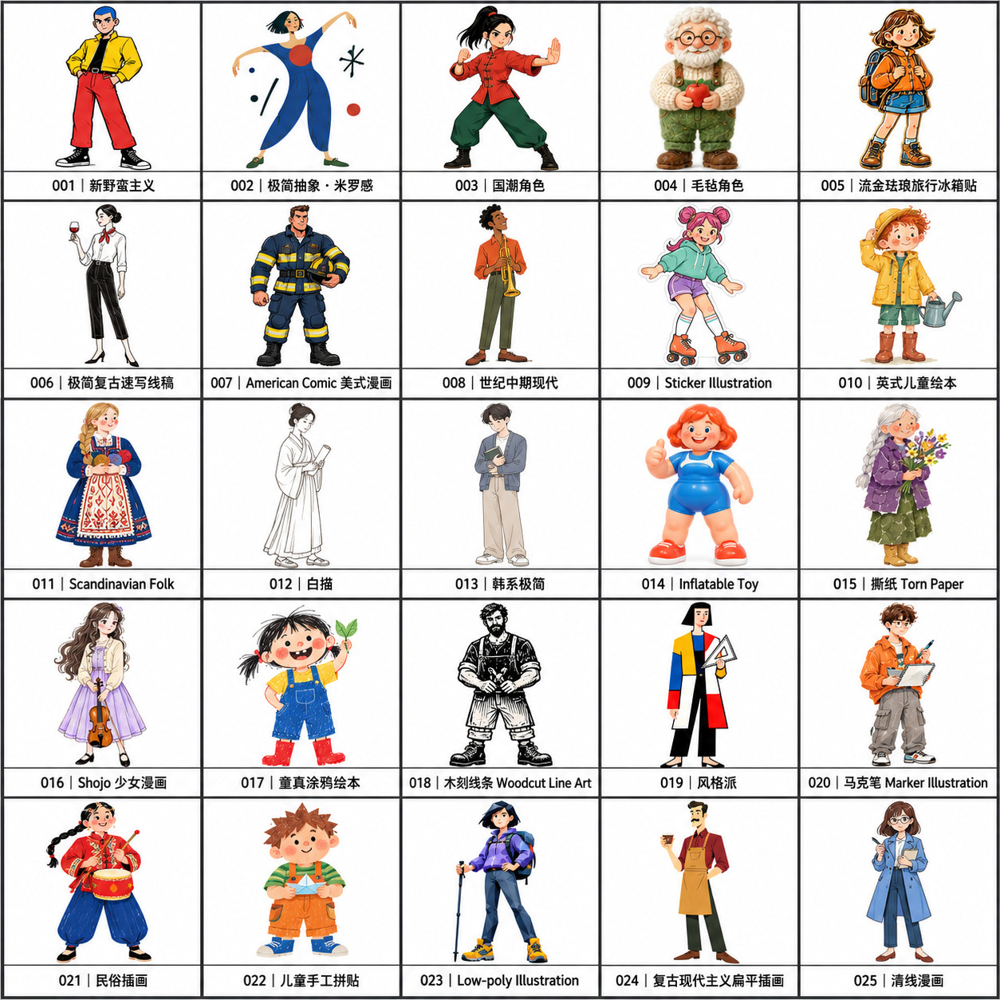
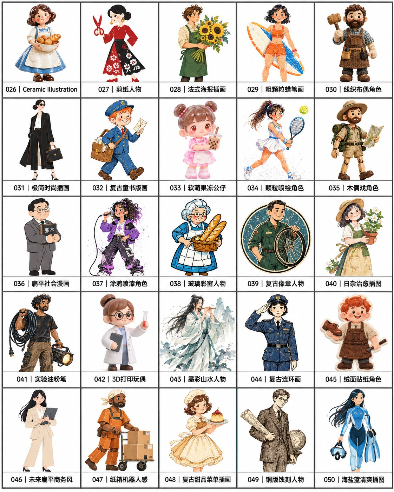
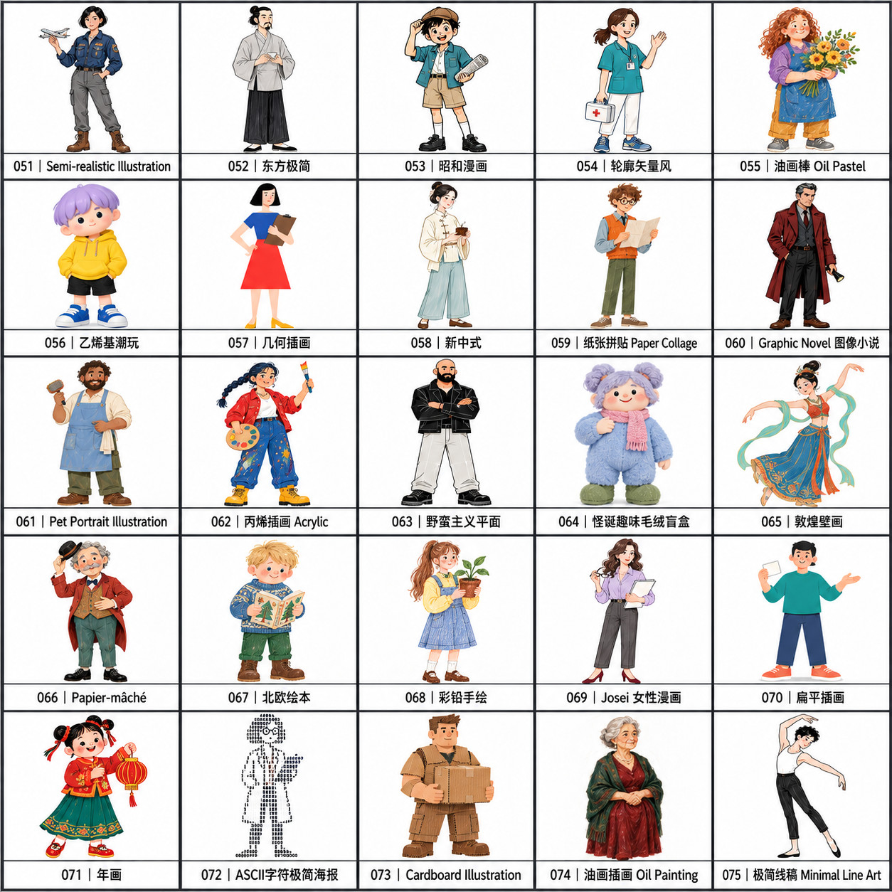
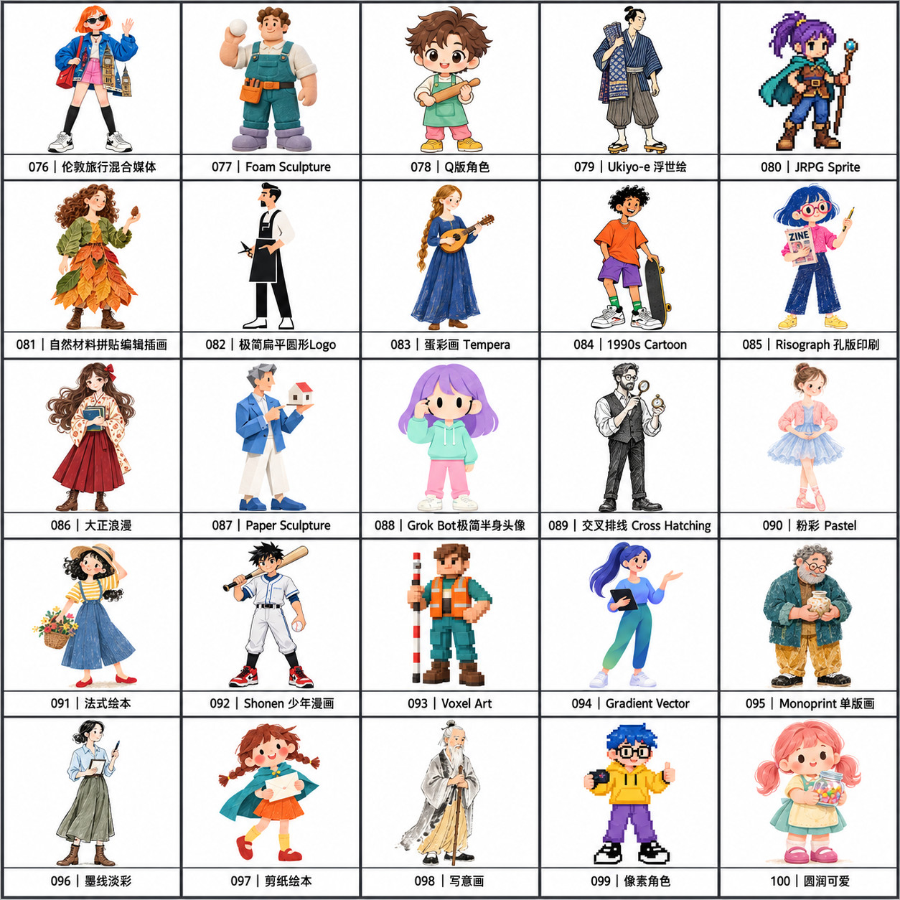
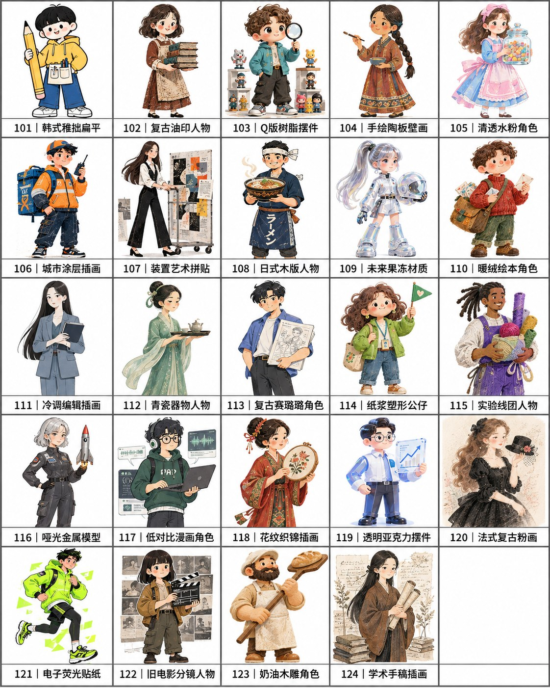
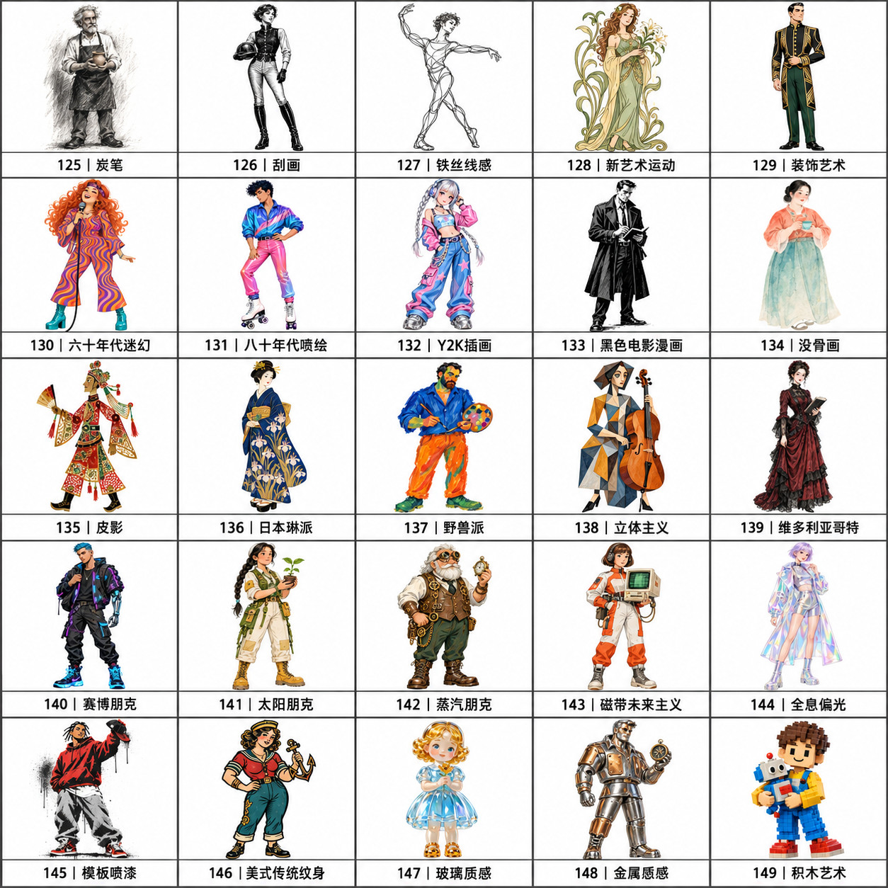

# DA Brand IP · ブランドキャラクター制作室

  

[简体中文](README.md) · [English](README.en.md) · [日本語](README.ja.md) · [한국어](README.ko.md)

`da-brand-ip` は、個人・企業・製品・組織の特徴を、繰り返し使えるキャラクター素材にまとめるスキルです。149 種類のスタイルを収録し、ヒアリング、方向性の選択、キャラクター候補、3 枚のデザイン資料、記事や広告への展開まで支援します。

## 特徴

- 人物写真からのキャラクター化、オリジナルマスコット、製品の擬人化、既存キャラクターの整理に対応。
- 用途に合う 3〜5 種類のスタイルを提案。新規制作では原則 3 枚の独立した候補を作成。
- メインデザインカード、三面図、5 ポーズ＋6 表情の一覧を、白背景の独立した 3 ファイルで納品。
- 複数ブランド・キャラクター・バージョンを管理し、確定済みパッケージを ZIP で移行。
- 基本資料のラベルは英語。記事や広告の文字は原文の言語に合わせ、掲載先に応じて構成。

## Codex へのインストール

リポジトリをダウンロード・展開し、ルートで次のコマンドを実行します。既存のインストールがある場合は、混在を避けるため先にバックアップしてください。

```bash
# Run from the downloaded repository directory.
mkdir -p "$HOME/.codex/skills/da-brand-ip"
cp -R SKILL.md agents assets references scripts requirements.txt "$HOME/.codex/skills/da-brand-ip/"
```

次の会話ターンから利用できます。Windows では同じファイルとフォルダーを `%USERPROFILE%\.codex\skills\da-brand-ip` にコピーします。ローカル処理には Python 3.9+、固定レイアウトには Pillow と適切なフォントが必要です。キャラクター生成にはホスト側の画像生成機能を使います。

## はじめに

```text
$da-brand-ip を使い、若者向けコーヒーブランドのキャラクターを制作してください。
温かく覚えやすい印象で、パッケージや SNS に使いたいです。
まず方向性とスタイルを提案してください。
```

```text
$da-brand-ip を使い、添付の既存キャラクターをデザインカード、三面図、
ポーズと表情の一覧に整理してください。
```

```text
$da-brand-ip を使い、確定済みキャラクターでブログ記事の画像を作ってください。
掲載先：自社サイト。記事全文：[本文を貼り付け]
```

## 149 種類のスタイルと参考画像

[スタイル一覧](references/style-menu.md)の3桁の番号または名前で選択します。6枚の正方形JPEGは 001–025、026–050、051–075、076–100、101–124、125–149 の順です。5枚目の最後のマスは空白です。詳しい条件は各スタイルのルールを参照してください。クリックすると拡大できます。

番号・ID・ファイル名は3桁の `001–149` に統一しています。例：`001` は `references/styles/001.md` に対応します。

[](assets/previews/1.jpg)

[](assets/previews/2.jpg)

[](assets/previews/3.jpg)

[](assets/previews/4.jpg)

[](assets/previews/5.jpg)

[](assets/previews/6.jpg)

125–149 の全身プレビューはユーザーが確認済みです。三面図、ポーズ・表情シート、人間以外のキャラクターは実画像で未検証です。

## 制作の流れと納品物

ヒアリング → 方向性・スタイル → 候補 → 特徴の固定 → 3 枚の資料 → 確認・保存 → コンテンツへの展開。

| ファイル | 内容 | 比率 |
|---|---|---|
| `01-main.png` | 全身像、最大 6 枠の特徴、5〜7 色のパレット | 1:1 |
| `02-turnaround.png` | 正面・側面・背面 | 3:2 |
| `03-overview.png` | 全身 5 ポーズと半身 6 表情 | 4:3 |

パッケージには `character.json` と `manifest.json` も含まれます。未承認の修正は使用中の版を置き換えません。[パッケージ管理](references/package-management.md)を参照してください。

## ローカル開発

```bash
python3 -m pip install -r requirements.txt
python3 scripts/check_release.py
python3 scripts/package_manager.py --help
python3 scripts/compose_board.py --help
```

`package_manager.py` は素材管理、`compose_board.py` は既存画像の固定配置を担当します。レイアウトは `assets/layouts/`、スタイルは `references/styles/` にあります。スキル本体と運用資料は現在中国語です。


## プライバシーと素材

写真、ブランド資料、記事、生成物はスキル内ではなく、通常 `.da-brand-ip/` などの独立した作業フォルダーに保存します。利用権限のある素材を使用してください。画像生成機能がない場合はプロンプトと仕様を提供し、未生成であることを明示します。

## ライセンスとお問い合わせ

[MIT License](LICENSE) · Copyright © DAAI。ご意見は [Issues](https://github.com/daaihq/da-brand-ip-skill/issues) にお寄せください。
